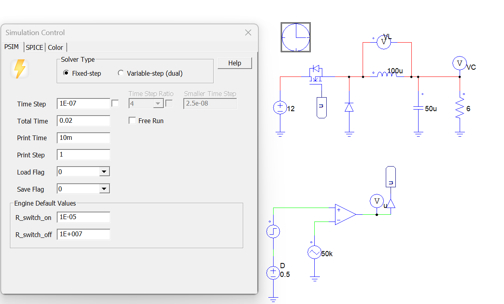
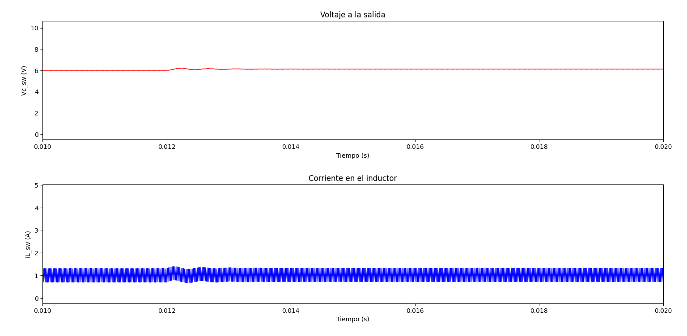
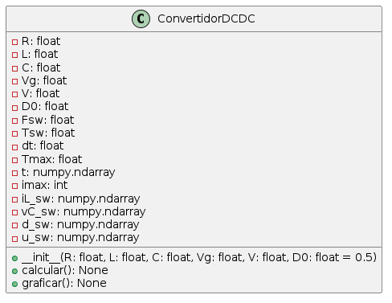
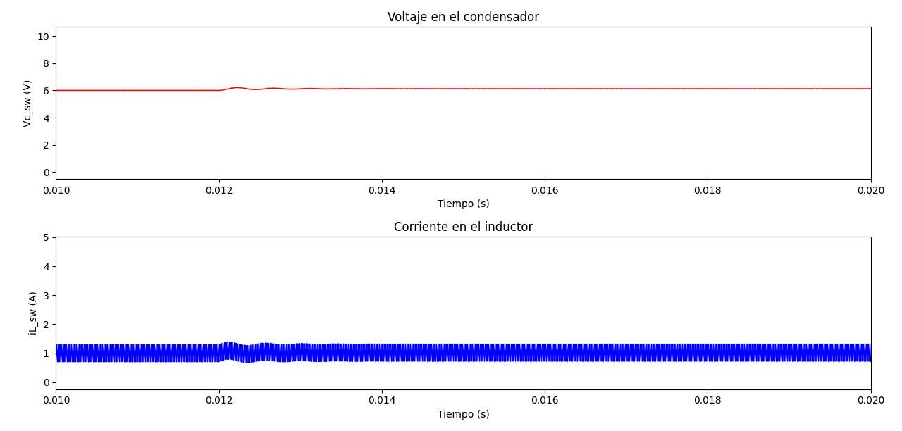
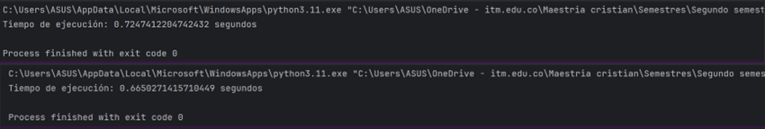

# **Algorithms for Buck converter**  

**Cristian Escudero Quintero**

## **Problem description: Model of Buck converter**

Design and simulate a buck converter to reduce the output voltage from the input voltage, with the objective to regulate the controlled output voltage. 

**Description:**

Buck converter is a power converter DC-DC, in charge of reducing the input voltage to a lower DC output voltage. This converter uses a switch typically a transistor and diode, controlled by a PWM to regulate the output voltage ​[1]​. The algorithms employed in buck converters are formulated to determine the duty cycle of the switch and the circuit parameters, including current and voltage, to accomplish the intended output regulation. These algorithms may be executed utilizing various methodologies, such as solving differential equations or employing control strategies. The primary aim of these algorithms is to guarantee effective and consistent operation of the buck converter across a broad spectrum of load and input circumstances​[2]​. 

Buck converter is compound inductor L, diode, switch S, capacitor C, and load (resistive) R. The converter operated during the switch conduction period (duty D), during the transistor (Mosfet) is closed, the current flows from the power supply through the inductor at this time the inductor is charged supplying power to the load. During this time, the energy stored in the inductor increases. Then, the switch is opened, and the diode is directly biased, allowing the inductor current to flow through the load and the diode. During this phase, the energy stored in the inductor is released and supplies power to the load ​[3], [4]​. 

To model the buck converter, mathematical equations are needed to analyze the system behavior as a function of time ​[5]​. This equation describes the inductor current and capacitor voltage in response to changes in PWM duty cycle and load conditions. In this way, the difference equations are solved to analyze the converter behavior in steady state. Then a control loop is used to calculate the inductor current, capacitor voltage and PWM duty cycle at each time step. 

  

 Buck converter and parameters  
 
 

Switch model (Inductor currents and capacitor voltages are described): 

$$\frac{di_{l}}{dt}=\frac{V_{g}-V_{c}}{L}$$

$$\frac{dV_{c}}{dt}=\frac{i_{L}}{C}-\frac{V_{c}}{CR}$$

To perform the mathematical model, we use the software MATLAB, in which we will develop all the equations and use the necessary variables to solve the behavior of this convertePrincipio del formularior. 

The variables to develop the buck converter model are: 

**R**: Resistencia ; **L**: Inductor; **C**: Capacitor ; **Vg**: Input Voltage 

**D**: Duty cycle or Voltage conversion ratio $\left ( \frac{V}{V_{g}} \right )$; **il**: Inductor current ; **Fsw**: Switching frequency 

**Tws**: Switching period ; **Tmax**: Maximum time of simulation ; **t**: Vector that stores the time values for the simulation. 

**Imax**: Length of time vector ; **V**: Output voltage ; **dt**: Time step 

The code is structured as follows: first, the system variables are defined. The integration step dt is established, along with the simulation time Tmax and the time vector t. Then, vectors are initialized to store the variables. Next, the duty cycle is defined. After 12 ms, the duty cycle increases by 1%. The pulse width modulation (PWM) is confined between zero and t, and the output u is defined to ensure a proper pulse width. Following this, the switched model is defined, and Euler integration is performed. The final step involves controlling the diode to prevent the current flowing through it from becoming negative. 

A code is developed in matlab which is passed to python programming (**ecuaciones_dinamicas_original.py**).

After implementing the code, the most relevant variables, which are the output voltage and the inductor current, are plotted to analyze their behavior with the simulations. 

Furthermore, the code includes a main loop, a 'for' loop, which performs the calculations and the simulation of the Buck converter for each time step in the time vector. It calculates the duty cycle of the switch using pulse width modulation (PWM) to determine whether the switch is on or off, and then computes the differential equations to obtain the voltage across the capacitor and the current through the inductor. Additionally, it considers the action of the diode in the inductor to prevent negative currents. 

The following graph is obtained from the code implemented in Python. 

  

 Output voltage and current of the inductor with the original code, Figure_1  
 
 

In the Figure_1, it can be observed that the voltage remains at a voltage of 6V, and at time 0.012, we are going to increase the duty cycle by 1%. So, we will go from 0.5 to 0.51. The same change happens with the current. Principio del formulario. 

 

**Now, three algorithms are selected, each of which includes loops, and their complexity is evaluated.** 

Three algorithms are developed, one of which calculates the output power of the converter, another determines the period of the inductor current signal, and a third algorithm enhances the calculation of the converter model equations. For the algorithms, variables are first initialized for their operation. Then, the duty cycle, converter equations, and power are calculated using 'for' loops. The presented algorithms have a complexity of O(n), which is linear, as they involve simple loops iterating over a fixed and small number of elements. 

The codes start with a 'for' loop that calculates the duty cycle and the PWM control signal for each time step in the time vector. Then, another 'for' loop is executed to compute the voltage across the capacitor and the current through the inductor using the Buck converter equations. Additionally, the diode action is considered to prevent negative currents in the inductor. Subsequently, the instantaneous output power is calculated by multiplying the capacitor voltage by the inductor current. Next, the average power is computed by summing all instantaneous powers and dividing by the total number of samples. Finally, the zero-crossing of the inductor current is found to calculate the period of the current signal (iL_sw), and the result is printed. 

The implemented code is as follows in **los3algoritmos.py**, this code has the implementation of 3 codes with use of loops. 

**After selecting the codes modifications are made to the code to reduce its complexity and improve its performance. Additionally, its new complexity is calculated.**

One of the modifications to the code was to define a function calculate_values() to calculate the values of the inductor current (iL_sw) and the capacitor voltage (vC_sw) for each time step using the differential equations of the Buck converter, something inside this function, calculate the derivative of the inductor current (diL_dt_sw) and the capacitor voltage (dVc_dt_sw) using the circuit equations, then update the inductor current and capacitor voltage values for each time step. In addition, functions are used to calculate averages, calculate differences between elements in an array, return positions of elements in an array and function to determine the sign of the elements of an array, **algoritmos.py**.  

  

 comparison of algorithms  
 
 

On the right side, algorithms with for loops are used to calculate the derivatives and the average. On the left side, a class is used to optimize the algorithm for calculating the average.

**The code is now rewritten using Object Oriented Programming. It is also graphed and finished with the comparison between the implemented codes.**

Functions and formulas are used, such as: 

__init__: This method initializes the variables or attributes, which represent the parameters of the converter and the vectors to store the results. 

**calculate**: This method performs the converter calculations. It includes the calculation of the duty cycle(d_sw), the voltage on the capacitor(vC_sw), and the current in the inductor(iL_sw) for each time step in the time vector(t). The following formulas are used. 

**graficar**: This method plots the voltage on the capacitor(vC_sw) and the current in the inductor(iL_sw) as a function of time. 

An uml diagram is presented which that includes declarations of variables and definitions of functions, with R: float, L: float, etc.: These lines are declare variables with names like R, L, C, also function definitions named calcular  and graficar  that likely perform calculations or generate graphs, respectively and  _init_(: This be a constructor function).

  

 Output voltage and current of the inductor with the original code using objects-oriented programming  
 
 

All this is developed in the **ecuaciones_dinamicas_oop.py**, use code using objects-oriented programming. 

subsequently, an object of the class ConvertidorDCDC is instantiated with the specific parameters of the converter (resistance, inductance, capacitance, input and output voltages), then the calculate method is called to perform the calculations of the converter behavior. The code is finalized with the graficar method to visualize the results. 

The object-oriented implementation does not affect the obtained graphs, resulting in the same graphical representation as in the original code in the figure 2.

  

 Output voltage and current of the inductor with the original code using objects-oriented programming  
 
 

The graphs display the output voltage of the converter and the current in an inductor circuit. The output voltage is regulated at 6V. This is achieved by solving the differential equations of the converter, and a duty cycle of 0.5 is assigned. This regulates the output from 12V to 6V and increasing this duty cycle to 0.51 similarly regulates the output voltage. The current is also calculated using the equations, resulting in an average value of 1A.

 

  

 Output voltage and current of the inductor with the original code using objects-oriented programming, figure 3  
 
 

The difference observed is not very significant; the object-oriented code exhibits a slightly faster response than the original.

In the figure 3, we can observe a comparison of the two codes. In the upper part, we have the execution time of the original code, without modifications, and in the lower part, we have the object-oriented code. We can clearly see a significant reduction in execution time.

The code implementations for both buck converters show similar results in terms of performance and accuracy in simulating the system response. However, it has been observed that the object-oriented implementation shows a more organized algorithm, which improves the understandability and maintainability of the code. To further improve the code, the following enhancements could be considered: performance improvement, additional enhancements can be executed to improve the computational efficiency of the algorithm, such as optimizing the operations in NumPy to reduce the execution time

**References** 

[1]	U. M. P. K. M. School of Electrical Systems Engineering, “Small-signal AC modeling technique of Buck converter with DSP based Proportional-Integral-Derivative (PID) controlle,” IEEE, 2009.

[2]	J. J. Herrera-Pérez and A. Garcés-Ruiz, “Análisis de estabilidad de convertidores de segundo orden con la metodología de optimización de suma de polinomios cuadráticos,” Transactions on Energy Systems and Engineering Applications, vol. 1, no. 1, pp. 49–58, Dec. 2020, doi: 10.32397/tesea.vol1.n1.4.

[3]	J. Miguel Yate Alcalá, “PROYECTO FIN DE CARRERA INGENIERO ELECTRÓNICO por.”

[4]	N. S. Zúñiga-Peña, M. A. Márquez-Vera, J. C. Ramos-Fernández, L. F. Cerecero-Natale, and F. Muñoz-Palacios, “Regulación de voltaje de un convertidor buck-boost mediante su modelo difuso inverso Voltage regulation for a buck-boost converter by using its inverse fuzzy model,” 2018.

[5]	S. P. L. 1, L. G. G. M. 2 Rafael Gallardo A.1, “Diseño de un cargador de baterías en aplicaciones de energía solar,” MASKANA, I+D+ingeniería, 2014.

